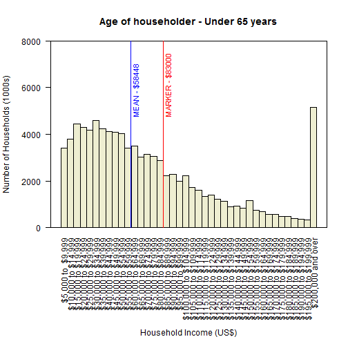

## Purpose

This app provides users with an opportunity to browse US income data broken down by category.

 

---

## Benefits

This quick visualization capability allows users to:

* Look for trends
* Do quick comparisons across categories
* Bring up data of particular interest to the user, and visualize it in a compelling way

The method used to break down this data can easily be generalized and expanded upon to accomodate a broad range of data sets, providing a standard platform for quick data visualization and review.

---

## Sample Question

Suppose we want to know how our household income of $83000/year compares with others in the work force.  Here we can see a sample of the raw data for this question...


```r
colLabels <- colnames(incData[5:(ncol(incData) - 2)])
sampleDf <- as.data.frame(as.character(incData[28,]))
colnames(sampleDf) <- "Sample Data"
rownames(sampleDf) <- colnames(incData)
head(sampleDf, 7)
```

```
##                           Sample Data
## Category           Age of householder
## Characteristic         Under 65 years
## Total                           94223
## Under $5,000                     3456
## $5,000 to  $9,999                3420
## $10,000 to $14,999               3794
## $15,000 to $19,999               4427
```

---

## Sample Question Plot

Here is a sample plot of the same data.  We can see that our income is well above the mean, but there are also quite a few households making more than us.

 
